# 🚗 AI Claims Assessment System

> **Advanced AI-powered vehicle damage analysis and cost estimation platform using YOLOv8 and Computer Vision**

[](https://www.python.org/downloads/)
[](https://streamlit.io/)
[](https://github.com/ultralytics/ultralytics)
[](LICENSE)

---

##  Table of Contents

- [Overview](#-overview)
- [Features](#-features)
- [System Architecture](#-system-architecture)
- [Application Flow](#-application-flow)
- [Class Diagrams](#-class-diagrams)
- [Installation](#-installation)
- [Usage](#-usage)
- [Project Structure](#-project-structure)
- [Technology Stack](#-technology-stack)
- [API Documentation](#-api-documentation)
- [Contributing](#-contributing)
- [License](#-license)

---

## Overview

The AI Claims Assessment System is an end-to-end automated solution for vehicle insurance claim processing. It leverages state-of-the-art YOLOv8 models for damage detection and severity assessment, combined with advanced computer vision techniques for fraud detection and cost estimation.

### Key Capabilities

- **Damage Detection**: Identifies 7+ types of vehicle damage using YOLOv8
- **Severity Assessment**: Classifies damage into Minor, Moderate, or Severe categories
- **Cost Estimation**: Provides accurate repair cost estimates with reconciliation
- **Fraud Detection**: Multi-layer fraud analysis with perceptual hashing and metadata checks
- **Explainable AI**: GradCAM heatmaps showing AI decision-making process
- **Text Analysis**: Optional damage description processing for improved accuracy
- **Report Generation**: Comprehensive assessment reports in text format

---

## ✨ Features

### Core Features

| Feature | Description |
|---------|-------------|
| **Real-time Detection** | Instant damage analysis using YOLOv8 models |
| **Multi-Modal Analysis** | Combines image and text inputs for better accuracy |
| **Cost Reconciliation** | Smart reconciliation between image and text-based estimates |
| **Quality Assessment** | Blur detection, brightness, and overall image quality scoring |
| **Fraud Prevention** | Detects manipulated images, duplicates, and suspicious patterns |
| **Visual Explanations** | GradCAM heatmaps for transparent AI decisions |
| **Responsive UI** | Modern, gradient-based interface with glassmorphism |

### Supported Damage Types

```
✅ Scratches & Paint Damage    ✅ Broken Glass & Windows
✅ Dents & Body Damage          ✅ Lamp & Light Damage
✅ Bumper Damage                ✅ Door & Panel Damage
✅ Hood & Trunk Damage
```

---

## System Architecture



### Architecture Description

The system follows a **layered architecture** pattern:

1. **Frontend Layer**: Streamlit-based web interface for user interaction
2. **Processing Layer**: Image preprocessing, quality checks, and text processing
3. **AI Model Layer**: YOLOv8 models for detection, classification, and explainability
4. **Analysis Layer**: Fraud detection, cost estimation, and reconciliation logic
5. **Output Layer**: Results compilation, visualization, and report generation

---

## Application Flow

### Flow Description

1. **Upload Phase**: User uploads vehicle damage image
2. **Optional Text**: User can provide damage description
3. **Preprocessing**: Image quality check and normalization
4. **Detection**: YOLOv8 identifies damage type
5. **Assessment**: YOLOv8 classifies severity level
6. **Parallel Analysis**: Simultaneous fraud detection, cost estimation, and explainability generation
7. **Reconciliation**: Combines image and text-based estimates (if provided)
8. **Recommendation**: AI generates approval/review/rejection recommendation
9. **Output**: Display results with visualizations and downloadable report

---

## Class Diagrams

### Core Processing Classes


### Assessment Flow Classes



---

##  Installation

### Prerequisites
- make sure to install all the libraries used : 
```bash
pip torch torchvision grad-cam opencv-python numpy Pillow matplotlib seaborn ImageHash ultralytics requests kagglehub streamlit pillow numpy opencv-python ImageHash 
```
- Python 3.8 or higher
- pip package manager
- Virtual environment (recommended)

### Step 1: Clone Repository

```bash
git clone https://github.com/nilavra17ghosh/MEGATHON25.git
cd MEGATHON25
```


---

## 💻 Usage

### Running the Application

```bash
streamlit run main.py
```
or
```bash
python -m streamlit run main.py

```

The application will open in your default browser at `http://localhost:8501`

### Using the System

1. **Upload Image**: Click the browsfile 
2. **Add Description** (Optional): Provide text description of the damage
3. **Analyze**: Click "🔍 Analyze Damage" button
4. **Review Results**: See damage type, severity, cost estimate, and fraud risk
5. **Download Report**: Export comprehensive assessment report


##  Project Structure

```
MEGATHON25/
│
├── main.py                          # Main Streamlit application
├── requirements.txt                 # Python dependencies
├── README.md                        # This file
│
├── config/
│   └── settings.py                  # Configuration settings
│
├── models/
│   ├── damage_model.py              # YOLOv8 damage detection wrapper
│   ├── severity_model.py            # YOLOv8 severity assessment wrapper
│   ├── damage_detection.pt          # Trained damage model (not in repo)
│   └── severity_assessment.pt       # Trained severity model (not in repo)
│
├── processing/
│   ├── preprocessing.py             # Image preprocessing utilities
│   ├── fraud_detection.py           # Fraud detection algorithms
│   ├── cost_estimation.py           # Cost calculation logic
│   ├── explainability.py            # GradCAM implementation
│   └── text_image_consistency.py    # Text analysis module
│
├── utils/
│   ├── assessment.py                # Main assessment orchestration
│   └── report.py                    # Report generation utilis
```

---

##  Technology Stack

### Core Technologies

| Technology | Purpose | Version |
|------------|---------|---------|
| **Python** | Primary language | 3.8+ |
| **Streamlit** | Web framework | 1.28+ |
| **PyTorch** | Deep learning | 2.0+ |
| **YOLOv8** | Object detection | Latest |
| **OpenCV** | Computer vision | 4.8+ |
| **NumPy** | Numerical computing | 1.24+ |
| **Pillow** | Image processing | 10.0+ |

### AI/ML Stack

- **YOLOv8** (Ultralytics) - Damage detection and severity classification
- **PyTorch** - Deep learning framework
- **GradCAM** - Explainable AI visualizations
- **Computer Vision** - Image quality and fraud detection

### Additional Libraries (Please make sure you are using the following version only )

```python
torch>=2.0.0
torchvision>=0.15.0
ultralytics>=8.0.0
streamlit>=1.28.0
opencv-python>=4.8.0
numpy>=1.26.0
Pillow>=10.0.0
imagehash>=4.3.0
matplotlib>=3.7.0
```

---

## 📚 API Documentation

### Core Functions

#### `assess_claim()`

Main assessment function that orchestrates the entire claim processing pipeline.

```python
def assess_claim(
    image: PIL.Image,
    damage_model: DamageDetectionModel,
    severity_model: SeverityAssessmentModel,
    preprocessor: ImagePreprocessor,
    fraud_detector: FraudDetector,
    cost_estimator: CostEstimator,
    explainer: ExplainabilityModule,
    user_description: str = ""
) -> dict:
    """
    Assess insurance claim with optional text description.
    
    Args:
        image: PIL Image object
        damage_model: Trained damage detection model
        severity_model: Trained severity assessment model
        preprocessor: Image preprocessing instance
        fraud_detector: Fraud detection instance
        cost_estimator: Cost estimation instance
        explainer: Explainability module instance
        user_description: Optional damage description text
    
    Returns:
        dict: Comprehensive assessment results including:
            - damage: {type, confidence}
            - severity: {level, confidence, all_probabilities}
            - fraud: {fraud_level, fraud_score, indicators}
            - cost: {estimated_cost, range, cost_band}
            - quality: {overall_quality, blur_score, brightness}
            - final_confidence: float
            - recommendation: str
            - explanation: PIL.Image (heatmap)
    """
```

#### `generate_report()`

Generates comprehensive text report from assessment results.

```python
def generate_report(
    results: dict,
    filename: str
) -> str:
    """
    Generate comprehensive text report.
    
    Args:
        results: Assessment results dictionary
        filename: Original image filename
    
    Returns:
        str: Formatted text report
    """
```

### Model Classes

#### DamageDetectionModel

```python
class DamageDetectionModel:
    def __init__(self, model_path: str):
        """Initialize with trained YOLOv8 model"""
    
    def predict(self, image: np.ndarray) -> dict:
        """
        Predict damage type.
        
        Returns:
            dict: {prediction: str, confidence: float}
        """
```

#### SeverityAssessmentModel

```python
class SeverityAssessmentModel:
    def __init__(self, model_path: str):
        """Initialize with trained YOLOv8 model"""
    
    def predict(self, image: np.ndarray) -> tuple:
        """
        Predict severity level.
        
        Returns:
            tuple: (probabilities_dict, severity_level)
        """
```

## 🎨 Customization

### Adding New Damage Types

Edit `models/damage_model.py`:

```python
self.class_names = [
    'scratches', 'dents', 'broken_glass', 
    'broken_lamp', 'your_new_type'
]
```

Update `processing/cost_estimation.py`:

```python
self.base_costs = {
    # ...existing costs...
    'your_new_type': 1500
}
```

### Modifying Cost Bands

Edit `processing/cost_estimation.py`:

```python
self.severity_multipliers = {
    'minor': 1.0,
    'moderate': 1.5,
    'severe': 2.5,
    'your_new_level': 3.0
}
```


## 👥 Authors

- **Team  adda236** 

---

## 🙏 Acknowledgments

- **Ultralytics** for YOLOv8 framework
- **Streamlit** for amazing web framework
- **PyTorch** team for deep learning tools
- Insurance industry experts for domain knowledge

---
# Ai Chat links
- ai_chat.txt contains the Ai_chat links used while doing the project 
---
**Built with ❤️ by Team adda236**:
 - Nilavra
 - Prakhar
 - Aryan
 - Mayank
 - Ved 
